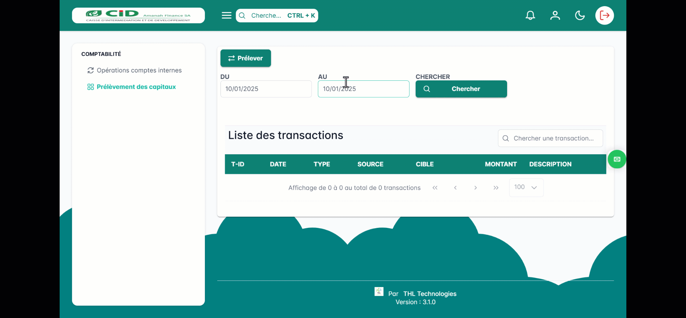

.. _accountant-index:

Comptabilité
============

Le module comptabilité comprend les options disponibles pour les comptables telles que :

Opérations sur les comptes internes
-----------------------------------

Cette option permet de gérer les transactions liées aux comptes internes de CID,
telles que les transferts entre comptes, le suivi des soldes, ....
Elle offre aux comptables les outils nécessaires pour assurer une gestion efficace des flux financiers internes.

.. image:: ../../_static/images/accountant/accountant.gif
   :alt: Opérations sur les comptes internes
   :align: center

Prélèvement des capitaux
------------------------

Cette fonctionnalité est dédiée à la gestion des opérations de prélèvement et d'investissement de capitaux.
Elle permet de suivre et d'enregistrer les mouvements financiers liés aux parts sociales,
aux actions ou à tout autre type de capital détenu par les parties prenantes de CID.

.. toctree::
   :maxdepth: 1

   new_features
   all_features