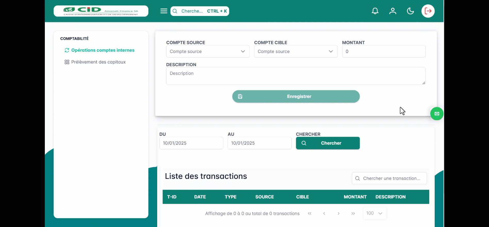

.. _accountant-index:

Comptabilité
============

Le module comptabilité comprend les options disponibles pour les comptables telles que :

1. Opérations sur les comptes internes
--------------------------------------

Cette option permet de gérer les transactions liées aux comptes internes de CID,
telles que les transferts entre comptes, le suivi des soldes, ....
Elle offre aux comptables les outils nécessaires pour assurer une gestion efficace des flux financiers internes.

Procédure
~~~~~~~~~

- Se connecter au logiciel
- Cliquer sur le module **Comptabilité** vous serez rediriger directement sur l'option
Opérations sur les comptes internes :
\a. **Transfert d'argent entre deux comptes internes : **
Dans le formulaire en haut de la page sélectionnez le compte interne source depuis lequel
l'argent va être débiter, ensuite le compte client cîble puis le montant à transférer.
Vous pouvez ajouté une description(facultative) à la transaction puis valider.
\b. **Historique des transactions**
Sur la page des opérations sur les comptes internes se trouve l'historique des transactions sur les comptes internes :
avec possibilité de trier par intervalle de date et de rechercher par montant de la transaction, le nom de l’agence ...

Démo
~~~~

2. Prélèvement des capitaux
---------------------------

Cette fonctionnalité est dédiée à la gestion des opérations de prélèvement et d'investissement de capitaux.
Elle permet de suivre et d'enregistrer les mouvements financiers liés aux parts sociales,
aux actions ou à tout autre type de capital détenu par les parties prenantes de CID.

Procédure
~~~~~~~~~

- Se connecter au logiciel
- Cliquer sur le module **Comptabilité**
- Cliquer sur le menu Prélèvement des capitaux :
\a. **Transfert de capitaux : **
Cliquer sur le bouton **Prélever** en haut et à gauche de la page. Un formulaire de prélèvement des capitaux
s'affiche, saisissez le code kyc du client, choisissez le compte interne des capitaux puis choisissez le montant à prélever
puis une description de la transaction si nécessaire puis prélever.
\b. **Historique des transactions**
Sur la page des prélèvements des capitaux se trouve l'historique des transactions sur les prélèvements :
avec possibilité de trier par intervalle de date et de rechercher par montant de la transaction, le nom de l’agence ...

Démo
~~~~

.. video:: ../../_static/images/accountant/hint_capital_withdrawal.mp4